# 🧠 AI-Based Health Symptom Checker and Wellness Tracker for Students Using No-Code Tools

---

## 📌 Overview

This project presents an AI-driven health symptom checker and wellness tracker designed specifically for students, built using no-code tools.

The system:
- Collects user symptoms via Google Forms
- Processes them using a ChatGPT-based natural language processing (NLP) model
- Generates probabilistic predictions of health conditions
- Uses a rule-based knowledge map to associate symptoms with conditions and remedies
- Stores and visualizes data using Google Sheets

Additionally:
- A point-based reward system encourages healthy habits
- Ethical considerations like bias mitigation and medical disclaimers are included

This project demonstrates how AI concepts such as intelligent agents, logical reasoning, and NLP can be applied in a practical, low-cost environment without traditional programming.

---

## 🚀 Introduction

Student health is an important factor that directly affects:
- Academic performance
- Focus
- Overall well-being

In today’s fast-paced academic environment, students often experience:
- Stress
- Lack of sleep
- Fatigue
- Excessive screen time

However, many students ignore early symptoms due to:
- Busy schedules
- Lack of awareness
- Assuming problems are minor

Ignoring symptoms can lead to serious health issues over time.

Also, students may not always have immediate access to medical guidance for early-stage concerns.

### ❗ Problem
There is a gap between:
- Symptom awareness
- Timely action

### 💡 Solution

This project proposes an AI-based Health Symptom Checker and Wellness Tracker using no-code tools.

The system:
- Accepts symptoms via Google Forms
- Uses AI to analyze inputs
- Provides probability-based condition predictions
- Suggests wellness tips
- Tracks health patterns using Google Sheets

This approach is:
- Simple
- Cost-effective
- User-friendly
- Ethically safe

---

## 🎯 Objectives

- To design a symptom input system using Google Forms  
- To analyze symptoms using ChatGPT and NLP  
- To implement a logical symptom-condition mapping system  
- To track wellness data using Google Sheets  
- To promote healthy habits using a reward system  
- To ensure ethical and unbiased AI usage  

---

## ⚙️ Methodology

### 1. Data Collection
- Google Forms (symptoms, sleep, stress)

### 2. Data Processing
- ChatGPT analyzes symptoms
- Generates probability-based outputs

### 3. Knowledge Map
- Rule-based logic
- Example: IF headache + eye strain → screen fatigue

### 4. Data Storage
- Google Sheets

### 5. Visualization
- Charts for:
- Stress
- Symptoms
- Trends

---

## 🏗️ System Architecture

```mermaid
graph LR

A[👤 User] --> B[📝 Google Form]
B --> C[📊 Google Sheets]
C --> D[🤖 ChatGPT]
D --> E[📄 Output]
E --> F[📈 Dashboard]
F --> G[🎨 Canva Report]

%% Styling
style A fill:#FFB6C1,stroke:#333,stroke-width:2px,color:#000
style B fill:#FFD580,stroke:#333,stroke-width:2px,color:#000
style C fill:#87CEFA,stroke:#333,stroke-width:2px,color:#000
style D fill:#90EE90,stroke:#333,stroke-width:2px,color:#000
style E fill:#DDA0DD,stroke:#333,stroke-width:2px,color:#000
style F fill:#F4A460,stroke:#333,stroke-width:2px,color:#000
style G fill:#FF7F7F,stroke:#333,stroke-width:2px,color:#000
```

---

## 🤖 AI Concepts Used

### 🧩 AI Agent (Module 1)
The system acts as an intelligent agent that:
- Takes input (symptoms)
- Processes it
- Produces output (health suggestions)

### 🧠 Logic-Based Reasoning (Module 3)
- Uses IF-THEN rules
- Maps symptoms to conditions

### 💬 NLP (Module 5)
- ChatGPT processes natural language input
- Extracts meaning from symptoms

---

---

## ⚠️ Disclaimer

This is not a medical diagnosis system.  
Consult a doctor for serious issues.

---

## ✨ Features

- Symptom input form (30+ symptoms)  
- AI-based condition prediction  
- Probability-based output  
- Wellness tracking dashboard  
- Reward system  
- Knowledge mapping  
- Canva report generation  

---

## 🛡️ Ethical Considerations

- No personal sensitive data is stored  
- No medical diagnosis is provided  
- System avoids bias (no gender/age assumptions)  
- Transparent probability-based output  

---

## ⚠️ Limitations

- Not a medical diagnostic tool  
- Depends on user input accuracy  
- Limited knowledge base  
- AI predictions may not always be accurate  

---

## 📊 Conclusion

This project demonstrates how AI can be used simply and ethically to improve student wellness.

By combining:
- NLP
- Logical reasoning
- No-code tools

The system provides an:
- Accessible
- Scalable
- Cost-effective solution

for promoting health awareness among students.

---
